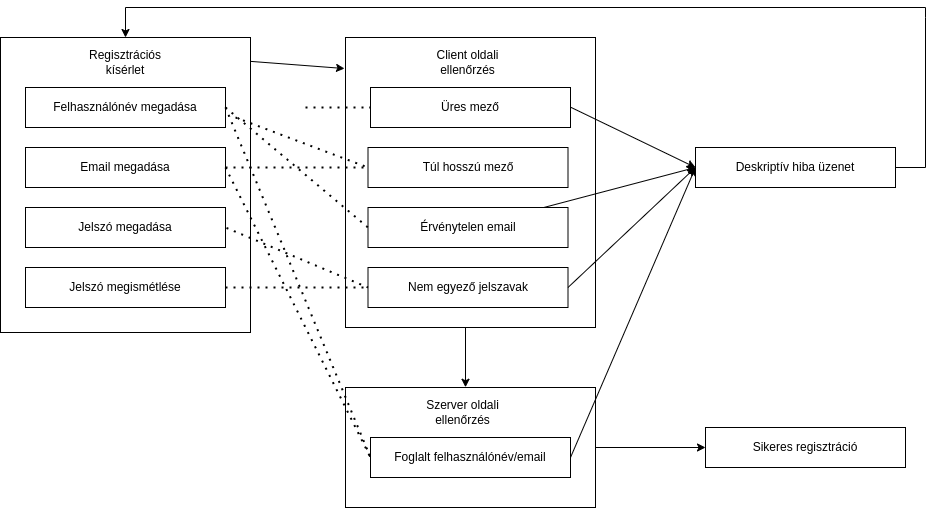
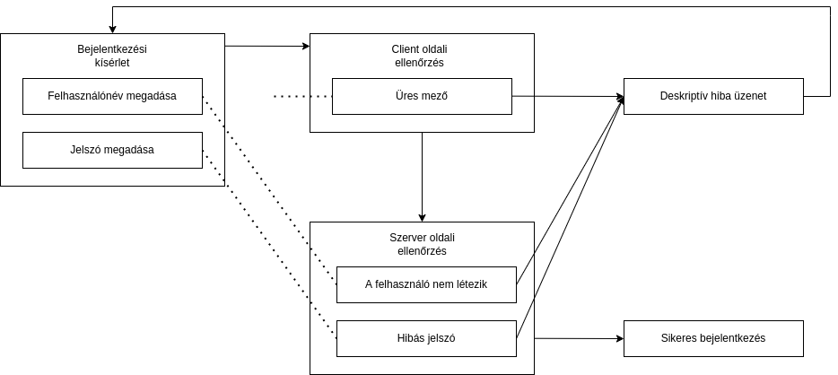
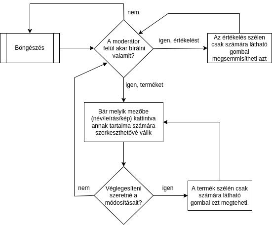

# Funkcionális specifikáció
## 1. Jelenlegi helyzet leírása
+ A megrendelő nem rendelkezik informatikai rendszerrel.
    - Meglévő rendszer bővítése lehetetlen.
+ A megrendelő egy boltal rendelkezik.
    - Az érdeklődőknek nyitvatartáskor kell informálódniuk (weboldal hiányában) -> időhöz kötöttség.
    - Az érdeklődőknek a bolt boltban kell megjelennie (weboldal hiányában) -> helyhez kötöttség.
+ A vásárlók megtartják véleményüket személyes körben.
    - A vásárlók véleményekről személyesen lehetséges tájékozódni (weboldal hiányában) -> decentralizáltság.
    - A vásárlók véleménye elfakul, elfelejtődik (adatbázis hiányában) -> múlandoság.

## 2. Vágyállomrendszer leírása
+ Egy olyan termék értékelő oldal, amellyen a termékek listája publikusan elérhető.
+ *felhasználó*k hozzáadhatnak termékeket és szövegesen értékelhetik bármelyiket. Amennyiben *felhasználó* névvel, email-el és jelszóval regisztráltak.
+ Az oldaltulajdonos az értékeléseket szabadon szerkesztheti vagy törölheti ha helyén valónak látja.

## 3. Jelenlegi üzleti folyamatok modellje
+ Jelenleg a bolt vásárlóinak csak is az eladók szakértélermére és hozzáértésére vannak bízva. Ahogy érdeklődni lehessen egy termékről a felhasználónak személyesen vagy telefonon kell felvenni a kapcsolatot az üzlettel. Ebből adódik a probléma, hogy a tudakozódás nyitáshoz kötött. Továbbá mivel az eladóknak nincs személyes tapasztalata minden termékről így sok nem egyértelmű részlet kívül esik a tudásokun.
+ Más boltok rendelkeznek a vágyálomban megfogalmazotthoz hasonló rendszerekkel. Ezzel piaci előnyhöz jutattva azokat.

## 4. Igényelt üzleti folyamatok modellje
+ Profil kezelés
    + felhasználó
    + moderátor
+ Termék lista olvasás
+ Termék kezelés
    + felvitel
    + értékelés
    + moderátori felülbírálás

## 5. Követelménylista

| Id | Modul | Név | Leírás |
| :---: | --- | --- | --- |
| FK2 | auth.php | bejelentkezés | *felhasználó* bejelentkezés kezelő |
| FK3 | auth.php | regisztráció | *felhasználó* regisztráció kezelő |
| FK4 | addProduct.php | Hozzáadás | új termék feltöltésére szolgáló felület |
| FK5 | list.php | böngésző | képes termék lista |
| FK6 | item.php | termék_leírás | egy-egy kiválasztott terméket megjelenítő oldal |
| FK7 | index.php | alapértelmezett_landoló | átirányít list.php-re. **Magyarázat**: a *böngészőt* szeretnénk landolási oldalnak, de (álltalában) az alapértelmezett az "index.php". bár ez átkonfigurálható szeretnénk az oldalt szerver alkalmazástól függetleníteni, ezért legegyszerűbb ha innen mindíg átirányítunk.
| FK101 | menubar.php | fejléc | minden oldal tetején megjelenő egységes menü; feltünteti a lehetőségeit (termék böngészés / regisztráció / bejelentkezés)  |
| FK201 | Makefile | a rendszer telepítésére szolgáló script

## 6. Használati esetek
1. Ha egy vásárló egy adott terméket már megvásárolt és kipróbálta akkor tapasztalatait megoszthatja az oldalon ezzel segítve a vásárlásra még csak készülő ember társait.
2. (Az első pontnak megfelelően) ha valaki online piac kutatást végez, hogy megtalálja a saját igényeinek legmegfelelőbb terméket akkor ezt az oldalt kereshetné fel.
3. A *moderátor* változtatni kíván egy termék adatain vagy az ahoz tarttozó értékeléseken. Példa: Egy termék képét szeretné kicserélni egy jobb minőségűbbre; Egy értékelés megfogalmazásának stílusát károsnak találja az üzletére ezért eltávolítaná;

## 7. Megfeleltetés, hogyan fedik le a használati eseteket a követelményeket
### Termék értékelés ###
| Lefedett használati eset | Követelmény |
| :---: | :---: |
| A felhasznó megnyitja az oldalt, itt több kattintható opció fogadja. | főoldal |
| A *felhasználó* a regisztrációt választva kitölt egy űrlapot az adataival amiket eltárolunk az adatbázisban. | regisztráció |
| A *felhasználó* *profil* adatai megadásával hitelesíti személy azonosságát. Ezzel jogot nyerve avélemény írásra és publikálásra. | bejelentkezés |
| A *felhasználó* megkeresi az adott terméket amit értékelni szeretne. | böngésző |
| A *felhasználó* a értékelni kívánt terméket kiválasztva megírja és publikálásja az értékelését. | termék_leírás | 
| Mivel a termékről még egy értékelés sem készült, ezért a *felhasználó* hozzá adja a termék listához, az első (saját) értékelléssel egyetemben. | Hozzáadás |
### Termék böngészés ###
| Lefedett használati eset | Követelmény |
| :---: | :---: |
| A felhasznó megnyitja az oldalt, itt több kattintható opció fogadja. | főoldal |
| A felhasznó a böngészést választva kap egy listát minden már értékelt termékről. | böngésző || A felhasznó a keresett terméket megtalálva annak saját oldalán elolvashatja a mások álltal hagyott értékeléseket. | termék_leírás |
### Üzemeltetői felülbírálás ###
| Lefedett használati eset | Követelmény |
| :---: | :---: |
| A *moderátor* megnyitja az oldalt, itt több kattintható opció fogadja. | főoldal |
| A *moderátor* miután a bejelentkezést választotta hitelesíti *profil* adatait. Innentől kezdve élhet moderátori jogkörével | főoldal |
| A *moderátor* kikeresi a módosítani kívánt terméket. | böngésző |
| A *moderátor* a megfelelő terméket kiválasztotta. Szabadon módosíthatja azt és a hozzá tartozó értékeléseket. | termék_leírás |

## 8. Képernyőtervek

## 9. Forgatókönyvek

1. Regisztráció

2. Bejelentkezés

3. Böngészés

4. Review írás

5. Termék hozzáadása

5. Moderálás

## 10. Funkció - követelmény megfeleltetése

| Id | Követelmény | Funkció |
| :---: | --- | --- |
| K1 | FK2 | M1 |
| K2 | FK3 | M2 |
| K3 | FK4 | M5 |
| K4 | FK5 | M3 |
| K5 | FK6 | M4 |
| k6 | FK101 | N/A |

## 11 Fogalomszótár
+ **review**: áttekintés idegen szóval
+ **profil**: az oldalon való személyazonosság hitelesítéshez szükséges adat halmaz.
    * részei:
        - felhasználó név
        - email cím
        - jelszó
        - jogkör
+ **jogkör**: egy felhasználható álltal végre hajtható műveletek halmaza.
    * fajtái:
        - felhasználói: értékelésírás; saját értékelés módosítás;-i képesség(ek)et ad
        - moderátori: felhasználó; bármely értékelés módosítás; bármely értékelés módosítás;-i képesség(ek)et ad
+ **felhasználó**: olyan személy aki rendelkezik *profil*-lal
+ **moderátor**: olyan felhasználó akinek *jogköre* moderátori
